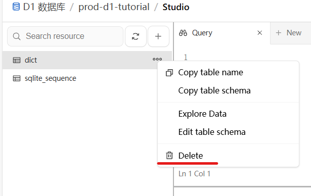

<div align="center">

</div>

# MC模组翻译参考词典

## 关于本项目

本项目旨在解决两个核心问题：

一方面，为了适应 CFPA 团队翻译数据的持续更新扩充，
同时应对原[MC百科](https://dict.mcmod.cn/)数据更新缓慢、页面使用不便的现状，
我们以MC百科版功能和页面为参照开发了开源网页版本，不仅完整保留原有功能，还新增了**中英互查、暗色模式、移动端适配、加强版数据库**等增强特性；

另一方面，针对部分热门Minecraft模组（如机械动力）的简体中文翻译由开发者直接维护（而非通过CFPA社区协作），
导致CFPA官方维护的MC百科模组词典（数据源为i18n-dict）存在更新滞后或内容缺失的问题。
本项目通过使用[加强版的数据库](https://github.com/VM-Chinese-translate-group/i18n-Dict-Extender)，有效弥补了这一缺口。

欢迎各路大佬高手为本项目提出建议和意见，或参与贡献！

## 功能特色

- 智能搜索，搜索结果按输入匹配度和出现频率排序
- 多种模式，支持英查中和中查英两种模式译文互查
- 智能合并，智能识别同一模组的不同版本译文并统一展示
- 自动分页，一页50条结果，网页下方支持快速跳转首页/尾页
- 记录键名，鼠标悬停在`所属模组`条目上方时会显示译文对应的键名
- 及时更新的数据源
- 页面美观，支持暗色模式，并且对手机上的显示效果进行了单独优化

## 技术细节

我们建议开发者搭建属于自己的API。由于词典数据库过于庞大，超过七十万行，
以及Cloudflare Worker的免费限制，一天能查询的数量有限，如果过多的用户查询很有可能不堪重负。

本项目网站关于部署及注意事项均在下面列出，供有兴趣的开发者搭建自己的版本。

### API 格式

本项目 API 请求格式如下：

```
https://api.vmct-cn.top/search?q=${query}&page=${currentPage}&mode=${mode}
```

其中：

  * `query` 参数为搜索的内容。
  * `currentPage` 参数为查询的页码，默认为 `1`。
  * `mode` 参数为搜索模式，有两种有效值：
      * `en2zh`：英文查中文（默认）。
      * `zh2en`：中文查英文。

另外还做了一些限制：每页最多返回 50 条条目，搜索词不能超过 50 字符，一次最多返回 500 页

**API 返回的 JSON 格式示例：**

```json
{
  "query": "stone",
  "results": [
    {
      "trans_name": "石头",
      "origin_name": "Stone",
      "modid": "mysticalagriculture",
      "version": "1.21",
      "key": "crop.mysticalagriculture.stone",
      "curseforge": "mystical-agriculture",
      "frequency": 81
    },
    {
      "trans_name": "石",
      "origin_name": "Stone",
      "modid": "silentgear",
      "version": "1.20",
      "key": "material.silentgear.stone",
      "curseforge": "silent-gear",
      "frequency": 13
    }
    // ... 更多结果
  ],
  "total": 1328,
  "page": 1,
  "mode": "en2zh"
}
```

返回的 JSON 对象包含以下字段：

  * `query`：当前搜索的查询词。
  * `results`：一个数组，包含符合搜索条件的翻译条目。每个条目都是一个对象，包含：
      * `trans_name`：翻译后的名称。
      * `origin_name`：原始名称。
      * `modid`：所属模组的 ID。
      * `version`：模组的版本。
      * `key`：译文对应的键名，鼠标悬停在网页上的“所属模组”条目上方时会显示此键名。
      * `curseforge`：CurseForge 上的模组 ID。
      * `frequency`：该译文的出现频率，用于智能排序。
  * `total`：符合搜索条件的总条目数。
  * `page`：当前查询的页码。
  * `mode`：当前搜索模式。

### 前端

前端为纯html js css内容，本项目将其托管在了Vercel上并连接了Github仓库，仓库推送更新自动同步项目页面。

在部署自己的项目时，请记得将 `public/script.js` 里的第三行 `API_BASE_URL` 替换为你部署的 API 地址。

另外还在前端做了速率限制（可配置时间），每秒最多搜索一次。

### 后端

所需环境：NodeJS

本项目所用的后端数据库和API分别部署在Cloudflare的D1 SQL数据库和Worker上，
然而D1数据库并不支持 [i18n Dict Extender](https://github.com/VM-Chinese-translate-group/i18n-Dict-Extender) 项目
中的sqlite3 `.db`格式，所以还需要转换为`.sql`格式。

关于创建worker并链接D1数据库请看[官方教程](https://developers.cloudflare.com/d1/get-started/)，下方仅列出上传数据库的处理步骤：

1. 下载原`.db`格式的数据库文件，并在SQLite官网下载[SQLite Tools](https://www.sqlite.org/2025/sqlite-tools-win-x64-3500200.zip)并解压。

2. 打开sqlite3.exe（我们只需要它，其他的可以删除），并输入下面的命令转换格式：

```
sqlite> .open Dict-Sqlite.db
sqlite> .output input.sql
sqlite> .dump
sqlite> .exit
```

3. 由于D1数据库的限制，我们还需要对数据库文件进行进一步的处理。
你可以在[release](https://github.com/Wulian233/mcmod-translation-dict/releases/tag/sql_cleaner)里下载适用于你的系统的打包好的版本。

> [!TIP]
> 请把程序放在和`input.sql`一个目录下！运行结束后会自动删除`input.sql`并生成`Dict-Sqlite.sql`。
>
> 注：Linux 和 MacOS 系统记得解压后运行。此工具代码由 AI 生成，作者其实不会 Rust。
> 它们的源代码在 [sql_cleaner](sql_cleaner/) 目录下。

4. 最后在本地终端输入

```cmd
npx wrangler d1 execute prod-d1-tutorial --remote --file=./Dict-Sqlite.sql
```

### 更新数据库方法：

浏览器进入存放词典数据的CloudFlare D1数据库，并删除整个`dict`表。之后方法同上。



## 版权归属

本项目代码部分使用[GPL3协议](LICENSE.md)。
[](LICENSE.md)

本项目数据库来自VM汉化组的[i18n Dict Extender](https://github.com/VM-Chinese-translate-group/i18n-Dict-Extender)项目，
翻译数据归属 CFPA 团队及其他模组译者，该作品采用 CC BY-NC-SA 4.0 授权。
